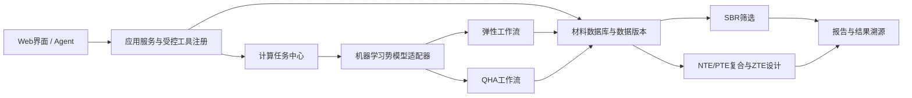

# 系统架构

平台V1采用模块化单体；耗时计算通过独立Worker执行，暂不拆分微服务。

用户上传结构首先进入ALIGNN快速筛选路径：预测`G`，结合MatterSim静态内聚能和CrystalNN配位数计算`E_tilde`，在秒级返回带误差区间的SBR判断。边界材料再升级到完整弹性张量和QHA工作流。

关键边界：

- `PotentialAdapter`只提供能量、力、应力及模型元数据；
- `ElasticWorkflow`和`QHAWorkflow`负责流程编排，不直接绑定MatterSim；
- Agent只能调用注册工具，不能执行任意Shell；
- 数据库同时记录材料事实、数据集版本、计算参数和结果来源；
- 长任务只传递任务ID，工作目录和大文件保存在`var/`或外部对象存储。

## Agent 控制层与计算层

Agent 采用与通用代码 Agent 类似、但限定在热膨胀领域的循环：模型负责理解问题和选择工具；FastAPI Harness 负责工具路由、动作审批、状态持久化和恢复；MatterSim/ALIGNN/QHA Worker 负责实际计算。

- 数据库查询、曲线分析等只读工具可以自动执行；
- QHA 等昂贵任务先写入 `agent_action_requests`，状态为 `PENDING_APPROVAL`；
- 前端独立审批接口是唯一能把请求转成后台计算任务的入口；
- 模型参数中不存在可以绕过审批的 `confirmed=true` 开关；
- 计算任务沿用 `calculation_jobs` 状态机，Agent 通过任务 ID 查询进度和结果；
- 对话附件只向模型暴露结构 ID 与检查摘要，原始文件保存在便携工作目录。
