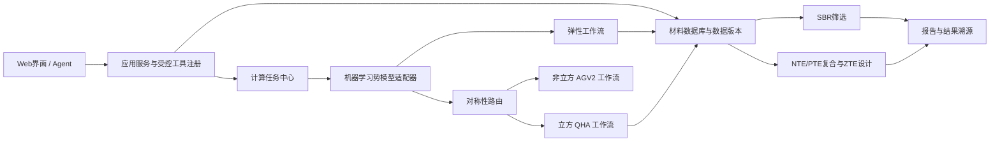

# 系统架构

平台V1采用模块化单体；耗时计算通过独立Worker执行，暂不拆分微服务。


```mermaid
flowchart LR
    UI["Web界面 / Agent"] --> API["应用服务与受控工具注册"]
    API --> DB["材料数据库与数据版本"]
    API --> JOB["计算任务中心"]
    JOB --> ADAPTER["机器学习势模型适配器"]
    ADAPTER --> ELASTIC["弹性工作流"]
    ADAPTER --> ROUTE["对称性路由"]
    ROUTE --> QHA["立方 QHA 工作流"]
    ROUTE --> AGV2["非立方 AGV2 工作流"]
    DB --> SBR["SBR筛选"]
    DB --> ZTE["NTE/PTE复合与ZTE设计"]
    ELASTIC --> DB
    QHA --> DB
    SBR --> REPORT["报告与结果溯源"]
    ZTE --> REPORT
```

用户上传结构首先进入ALIGNN快速筛选路径：预测`G`，结合MatterSim静态内聚能和CrystalNN配位数计算`E_tilde`，在秒级返回带误差区间的SBR判断。需要完整曲线时按晶体系统升级到立方 QHA 或非立方完整弹性张量 + AGV2 工作流。

关键边界：

- `PotentialAdapter`只提供能量、力、应力及模型元数据；
- `ElasticWorkflow`、`QHAWorkflow` 和 `AnisotropicGruneisenWorkflow` 负责流程编排，不直接绑定 MatterSim；上传结构先经 `SpacegroupAnalyzer` 路由：cubic → QHA，non-cubic → 完整弹性张量 + AGV2。无法解析对称性时任务直接失败，不静默回退。
- Agent只能调用注册工具，不能执行任意Shell；
- 数据库同时记录材料事实、数据集版本、计算参数和结果来源；
- 长任务只传递任务ID，工作目录和大文件保存在`var/`或外部对象存储。

## Agent 控制层与计算层

Agent 采用与通用代码 Agent 类似、但限定在热膨胀领域的循环：模型负责理解问题和选择工具；FastAPI Harness 负责工具路由、动作审批、状态持久化和恢复；MatterSim/ALIGNN/QHA Worker 负责实际计算。

- 数据库查询、曲线分析等只读工具可以自动执行；
- QHA 等昂贵任务先写入 `agent_action_requests`，状态为 `PENDING_APPROVAL`；
- 前端独立审批接口是唯一能把请求转成后台计算任务的入口；
- 模型参数中不存在可以绕过审批的 `confirmed=true` 开关；
- 计算任务沿用 `calculation_jobs` 状态机，Agent 通过任务 ID 查询进度和结果；
- 对话附件只向模型暴露结构 ID 与检查摘要，原始文件保存在便携工作目录。

## 对称性路由的运行契约

自动热膨胀接口为 `/api/precision/thermal-expansion-jobs`。任务参数会保留
`symmetry`、`actual_method` 与 `routing_reason`，结果同时保留兼容旧界面的
体积曲线 `thermal_expansion_curve`（单位 1/K）和 AGV2 的
`thermal_expansion_cartesian_curve`、`thermal_expansion_directional_curve`（单位 ppm/K）。

非立方任务需要在 `compute.env` 中配置：

```text
TEP_AGV2_SOURCE_ROOT=D:\\9.Project\\anisotropic-gruneisen-v2
```

可选的 `TEP_AGV2_MODEL` 用于指定 MatterSim checkpoint；未设置时由 AGV2
运行环境按 `--model-size 1M` 查找。AGV2 阶段失败会原样报告任务失败，绝不
自动切换为标量 QHA。
